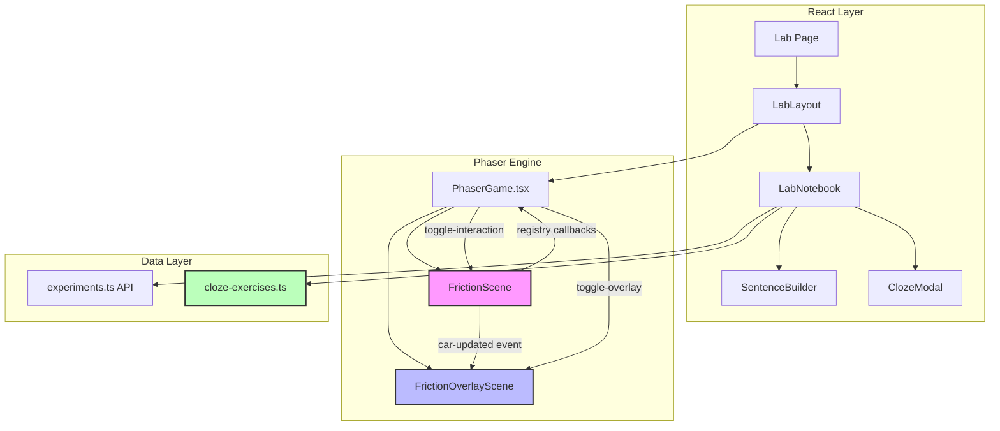

# Phase 7: Content Expansion - Friction Module

## Overview
Phase 7 extends the VibeStudy platform to prove scalability by implementing a second physics simulation module: **Friction - "Car on Surfaces"**. This module follows the same VRA (Virtual-Representational-Abstract) educational framework established in the Magnets module.

## Objectives
- Demonstrate platform extensibility with a new experiment type
- Implement friction physics simulation with car and surfaces
- Create educational content following VRA methodology
- Reuse existing infrastructure (LabLayout, LabNotebook, experiments API)
- Establish a template for future module additions

---

## Architecture Analysis: Existing Magnets Module

### Key Components
```
frontend/
├── components/
│   ├── game/
│   │   ├── PhaserGame.tsx          # React wrapper for Phaser, scene selection
│   │   └── scenes/
│   │       ├── MagnetsScene.ts     # Physics simulation (Virtual Layer)
│   │       ├── OverlayScene.ts     # Force vectors (Representational Layer)
│   │       └── BootScene.ts        # Scene bootstrap
│   └── lab/
│       ├── LabLayout.tsx           # Wrapper with toolbar + notebook sidebar
│       ├── LabNotebook.tsx         # Scientific method workflow
│       ├── SentenceBuilder.tsx     # CLIL sentence frames
│       └── ClozeModal.tsx          # Fill-in-the-blank exercises
├── lib/
│   ├── experiments.ts              # API client for experiment logging
│   └── cloze-exercises.ts          # Cloze exercise data
└── app/
    └── lab/
        └── [id]/
            └── page.tsx            # Dynamic lab route
```

### Design Patterns Identified
1. **Scene-based Physics**: Phaser scenes handle physics simulation independently
2. **Event-driven Communication**: Game ↔ React via `game.events.emit/on`
3. **Registry for State**: `game.registry` stores callbacks and state flags
4. **Quest-based Exercises**: Cloze exercises filtered by `questType` string
5. **Phase-based Workflow**: `ExperimentPhase` enum drives UI transitions

---

## Friction Module Design

### VRA Layer Implementation

#### Virtual Layer (Concrete Experience)
**Goal:** Interactive simulation where students push a car on different surfaces

**Physics Elements:**
- **Car Sprite**: A draggable/pushable vehicle with realistic mass
- **Surface Types**: 
  - Ice (μ ≈ 0.02) - Very low friction, car slides far
  - Wood (μ ≈ 0.3) - Medium friction, car slides moderately
  - Rubber (μ ≈ 0.8) - High friction, car stops quickly
- **Push Mechanic**: Student drags back and releases (like a slingshot)
- **Motion Physics**: Arcade physics with friction coefficient applied as deceleration

**Visual Feedback:**
- Surface texture changes visually when selected
- Car shows velocity-based animations (wheels spinning, trail effects)
- Sound effects for sliding, stopping

#### Representational Layer (Force Visualization)
**Goal:** Overlay showing friction force vectors and coefficients

**Overlay Elements:**
- **Friction Force Arrow**: Red arrow opposing motion direction
- **Applied Force Arrow**: Green arrow showing initial push
- **Normal Force Arrow**: Blue arrow perpendicular to surface
- **Coefficient Display**: μ value shown next to surface
- **Distance Meter**: Visual ruler showing how far car traveled

#### Abstract Layer (Scientific Rules)
**Goal:** Connect observations to physics principles through cloze exercises

**Cloze Templates:**
1. "Higher friction means the car moves ___" [slower]
2. "On ice, the friction force is ___ than on rubber" [smaller]
3. "Friction is a force that ___ moving objects" [slows down/opposes]
4. "The coefficient of friction on ___ is highest" [rubber]
5. "When friction increases, the stopping distance ___" [decreases]

---

## Technical Specification

### New Files to Create

```
frontend/
├── components/
│   └── game/
│       └── scenes/
│           ├── FrictionScene.ts        # Friction physics simulation
│           └── FrictionOverlayScene.ts # Friction force vectors
├── lib/
│   └── cloze-exercises.ts              # Add friction exercises
└── app/
    └── lab/
        └── friction/
            └── page.tsx                # Friction lab route (or modify [id])
```

### FrictionScene.ts Architecture

```typescript
// Pseudocode structure following MagnetsScene patterns
class FrictionScene extends Phaser.Scene {
  private car: Car;
  private currentSurface: SurfaceType = 'wood';
  private surfaceGraphics: Phaser.GameObjects.Graphics;
  
  // Surface friction coefficients
  private frictionCoefficients = {
    ice: 0.02,
    wood: 0.3,
    rubber: 0.8
  };
  
  create() {
    // Initialize surface background
    // Create car sprite with physics body
    // Add surface selector UI
    // Set up push/drag mechanics
  }
  
  update() {
    // Apply friction deceleration based on surface
    // Emit car data for overlay
  }
  
  private applyFriction() {
    // F_friction = μ * N (where N = m * g)
    // Deceleration = F_friction / m = μ * g
  }
  
  private getCarData() {
    // Return position, velocity, surface for overlay
  }
}
```

### FrictionOverlayScene.ts Architecture

```typescript
class FrictionOverlayScene extends Phaser.Scene {
  create() {
    // Listen for toggle-overlay event
    // Listen for car-updated event
  }
  
  update() {
    // Draw friction force vector (opposing velocity)
    // Draw applied force vector (initial push direction)
    // Show μ coefficient value
    // Display distance traveled
  }
  
  private drawFrictionVector() {
    // Red arrow opposing car motion
  }
}
```

### Integration with Existing Infrastructure

#### LabNotebook Updates
```typescript
// Prediction templates for friction
const FRICTION_PREDICTION_TEMPLATE = "I predict the car will travel {distance} on {surface}.";
const FRICTION_PREDICTION_OPTIONS = {
  distance: ['far', 'a medium distance', 'a short distance'],
  surface: ['ice', 'wood', 'rubber']
};

// Observation templates for friction
const FRICTION_OBSERVATION_TEMPLATE = "I observed the car traveled {result} on the {surface} surface.";
const FRICTION_OBSERVATION_OPTIONS = {
  result: ['very far', 'a moderate distance', 'a short distance'],
  surface: ['ice', 'wood', 'rubber']
};
```

#### Quest Type Detection
```typescript
// In LabNotebook or lab page
const questType = questId.includes('friction') ? 'friction' : 
                  questId.includes('magnet') ? 'magnets' : 'default';
```

---

## Mermaid Architecture Diagram



---

## Task Breakdown

### Task 7.1: FrictionScene.ts - Core Physics Implementation
**Priority:** High (Foundation)
- Create `FrictionScene.ts` with car sprite and physics body
- Implement surface selection (ice, wood, rubber)
- Implement push/slingshot mechanic for launching car
- Apply friction deceleration formula: a = -μg
- Add visual feedback (surface textures, car animations)
- Emit `car-updated` event for overlay consumption

### Task 7.2: Friction Educational Content (Cloze + Predictions)
**Priority:** High (Educational Value)
- Add 4-5 friction cloze exercises to `cloze-exercises.ts`
- Create prediction/observation sentence templates
- Update LabNotebook to detect friction quest type
- Add friction-specific phase messaging

### Task 7.3: FrictionOverlayScene.ts - Representational Layer
**Priority:** Medium (Enhancement)
- Create `FrictionOverlayScene.ts` for force visualization
- Draw friction force vector (red, opposing motion)
- Draw initial applied force vector (green)
- Display coefficient value (μ) near surface
- Add distance traveled indicator

### Task 7.4: Lab Routing and Integration
**Priority:** Medium (Glue Work)
- Create friction lab route or enhance dynamic routing
- Register FrictionScene in PhaserGame component
- Configure scene switching based on lab type
- Test full VRA workflow with friction experiment
- Verify cloze exercises appear correctly

### Task 7.5: Polish and Verification
**Priority:** Low (Quality)
- Add sound effects for car motion and stopping
- Ensure accessibility for surface selection
- Performance test with friction physics calculations
- Write verification checklist

---

## Educational Content Details

### Friction Cloze Exercises (Abstract Layer)

```typescript
// To be added to frontend/lib/cloze-exercises.ts
{
  id: 'friction-slowing',
  questType: 'friction',
  template: 'Friction is a force that {blank1} moving objects.',
  blanks: [
    { id: 'blank1', correctAnswer: 'slows down', options: ['speeds up', 'slows down', 'lifts', 'spins'] }
  ],
  explanation: 'Friction always opposes motion, causing objects to slow down.'
},
{
  id: 'friction-surfaces',
  questType: 'friction',
  template: 'A rough surface like {blank1} has {blank2} friction than a smooth surface like {blank3}.',
  blanks: [
    { id: 'blank1', correctAnswer: 'rubber', options: ['ice', 'wood', 'rubber', 'glass'] },
    { id: 'blank2', correctAnswer: 'more', options: ['more', 'less', 'equal', 'zero'] },
    { id: 'blank3', correctAnswer: 'ice', options: ['ice', 'rubber', 'sand', 'carpet'] }
  ],
  explanation: 'Rough surfaces create more friction because there is more contact area.'
},
{
  id: 'friction-distance',
  questType: 'friction',
  template: 'When friction is high, the car travels a {blank1} distance before stopping.',
  blanks: [
    { id: 'blank1', correctAnswer: 'shorter', options: ['longer', 'shorter', 'same', 'random'] }
  ],
  explanation: 'High friction removes energy faster, so objects stop in a shorter distance.'
},
{
  id: 'friction-coefficient',
  questType: 'friction',
  template: 'The coefficient of friction for {blank1} is the highest among ice, wood, and rubber.',
  blanks: [
    { id: 'blank1', correctAnswer: 'rubber', options: ['ice', 'wood', 'rubber'] }
  ],
  explanation: 'Rubber has the highest friction coefficient (μ ≈ 0.8) due to its rough texture.'
}
```

### Prediction/Observation Sentence Templates

**Prediction Phase:**
- Template: "I predict the car will travel {distance} on {surface}."
- Options:
  - distance: ["far", "a medium distance", "a short distance"]
  - surface: ["ice", "wood", "rubber"]

**Observation Phase:**
- Template: "I observed the car traveled {result} on the {surface} surface."
- Options:
  - result: ["very far", "a medium distance", "a short distance", "did not move"]
  - surface: ["ice", "wood", "rubber"]

---

## Success Criteria

1. **Virtual Layer**: Car can be pushed on 3 different surfaces with visible friction effects
2. **Representational Layer**: Force vectors display correctly when overlay is toggled
3. **Abstract Layer**: Friction cloze exercises appear after observation phase
4. **Integration**: Full Predict → Experiment → Observe → Learn flow works
5. **Scalability**: Architecture proves reusable for future modules

---

## Dependencies

- Phase 3 (Magnets) infrastructure must be stable
- Phase 5 (VRA layers) patterns serve as template
- No backend changes required (reuses existing experiments API)

## Risk Assessment

| Risk | Mitigation |
|------|------------|
| Physics feels unrealistic | Tune friction coefficients with real-world references |
| Scene switching complexity | Use existing dynamic routing, add lab type detection |
| Educational content too hard/easy | Test with target grade level (Grade 3) |
| Performance issues | Reuse optimization patterns from MagnetsScene |

---

## Implementation Order Recommendation

1. **Task 7.1** - FrictionScene.ts (core physics, can be tested standalone)
2. **Task 7.2** - Educational content (enables testing with LabNotebook)
3. **Task 7.4** - Lab routing (connects everything together)
4. **Task 7.3** - Overlay (enhancement, can come after basic flow works)
5. **Task 7.5** - Polish (final refinements)

This order ensures a working prototype early, with enhancements layered on top.
