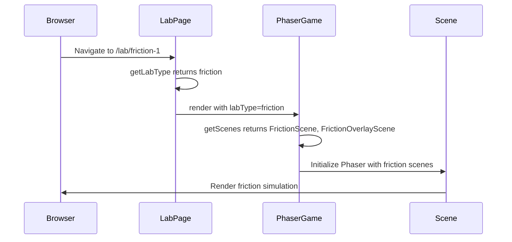

# Task 7.4: Lab Routing and Integration

## Status: Pending

## Goal
Integrate the Friction module into the existing lab routing system, enabling seamless switching between Magnets and Friction experiments.

## Requirements
- [ ] Create scene selection logic in PhaserGame
- [ ] Update dynamic lab routing to support friction labs
- [ ] Configure PhaserGame scene registration
- [ ] Add friction lab type detection
- [ ] Test full VRA workflow with friction experiment

## Architecture Decision: Scene Selection

### Option A: Enhanced Dynamic Routing (Recommended)
Use the existing `[id]` dynamic route and detect lab type from quest ID:

```typescript
// In lab/[id]/page.tsx
const labType = questId.includes('friction') ? 'friction' : 'magnets';
```

**Pros:** No new routes needed, follows existing pattern
**Cons:** Relies on naming convention

### Option B: Explicit Lab Type Routes
Create separate route folders:
- `/lab/magnets/[id]`
- `/lab/friction/[id]`

**Pros:** Explicit, clear separation
**Cons:** More routes to maintain, breaks existing links

### Recommendation
Use **Option A** with the existing dynamic route for MVP, as it requires minimal changes.

## Implementation Details

### 1. PhaserGame Scene Configuration

Update `frontend/components/game/PhaserGame.tsx` to support multiple lab types:

```typescript
import { MagnetsScene } from './scenes/MagnetsScene';
import { FrictionScene } from './scenes/FrictionScene';
import { OverlayScene } from './scenes/OverlayScene';
import { FrictionOverlayScene } from './scenes/FrictionOverlayScene';
import { BootScene } from './scenes/BootScene';

interface PhaserGameProps {
    config?: Phaser.Types.Core.GameConfig;
    onGameComplete?: () => void;
    showOverlay?: boolean;
    interactionEnabled?: boolean;
    labType?: 'magnets' | 'friction'; // NEW PROP
}

const PhaserGame: React.FC<PhaserGameProps> = ({ 
    config, 
    onGameComplete, 
    showOverlay = false, 
    interactionEnabled = false,
    labType = 'magnets' // Default to magnets for backward compatibility
}) => {
    // ... existing code ...

    useEffect(() => {
        if (gameRef.current || !containerRef.current) return;

        // Select scenes based on lab type
        const getScenes = () => {
            switch (labType) {
                case 'friction':
                    return [FrictionScene, FrictionOverlayScene, BootScene];
                case 'magnets':
                default:
                    return [MagnetsScene, OverlayScene, BootScene];
            }
        };

        const defaultConfig: Phaser.Types.Core.GameConfig = {
            type: Phaser.AUTO,
            parent: containerRef.current,
            backgroundColor: '#2d2d2d',
            scale: {
                width: 800,
                height: 600,
                mode: Phaser.Scale.FIT,
                autoCenter: Phaser.Scale.CENTER_BOTH
            },
            physics: {
                default: 'arcade',
                arcade: {
                    gravity: { x: 0, y: 0 },
                }
            },
            scene: getScenes(), // Dynamic scene selection
            ...config
        };

        gameRef.current = new Phaser.Game(defaultConfig);
        // ... rest of initialization
    }, [config, labType]); // Add labType to dependencies
    
    // ... rest of component
};
```

### 2. Lab Page Updates

Update `frontend/app/lab/[id]/page.tsx`:

```typescript
'use client';

import React, { useState, useCallback, useMemo } from 'react';
import dynamic from 'next/dynamic';
import { useSession } from 'next-auth/react';
import LabLayout from '@/components/lab/LabLayout';
import LabNotebook from '@/components/lab/LabNotebook';
import { LabProvider, useLab } from '@/contexts/LabContext';
import { ExperimentPhase } from '@/lib/experiments';

const PhaserGame = dynamic(() => import('@/components/game/PhaserGame'), {
    ssr: false,
    loading: () => (
        <div className="flex items-center justify-center w-full h-full text-slate-400">
            Loading Lab Environment...
        </div>
    )
});

// Lab type detection utility
function getLabType(questId: string): 'magnets' | 'friction' {
    if (questId.includes('friction')) return 'friction';
    return 'magnets';
}

// Lab titles
const LAB_TITLES: Record<string, string> = {
    magnets: 'Magnets Lab',
    friction: 'Friction Lab: Car on Surfaces'
};

function LabPageContent({ params }: LabPageProps) {
    const unwrappedParams = React.use(params);
    const { data: session } = useSession();
    const { showOverlay } = useLab();
    const [experimentPhase, setExperimentPhase] = useState<ExperimentPhase>('prediction');
    
    // Determine lab type from quest ID
    const labType = useMemo(() => getLabType(unwrappedParams.id), [unwrappedParams.id]);
    const labTitle = LAB_TITLES[labType];
    
    const userId = session?.user?.email || 'demo-user';
    const questId = unwrappedParams.id;

    // ... phase handlers (unchanged) ...

    return (
        <LabLayout
            title={labTitle}
            notebook={
                <LabNotebook
                    userId={userId}
                    questId={questId}
                    onPhaseChange={handlePhaseChange}
                    onExperimentComplete={handleExperimentComplete}
                />
            }
        >
            {gameConfig ? (
                <PhaserGame
                    config={gameConfig}
                    showOverlay={showOverlay}
                    interactionEnabled={experimentPhase === 'experiment'}
                    labType={labType}  // Pass lab type to PhaserGame
                />
            ) : (
                <div className="flex items-center justify-center w-full h-full text-slate-400">
                    Initializing Physics Engine...
                </div>
            )}
            
            {/* Phase-specific instruction overlays */}
            {experimentPhase === 'prediction' && (
                <div className="absolute inset-0 bg-black/50 flex items-center justify-center pointer-events-none z-10">
                    <div className="bg-slate-800 text-white px-6 py-4 rounded-lg shadow-xl max-w-md text-center">
                        <p className="text-lg font-medium">
                            📝 First, make your prediction in the Lab Notebook!
                        </p>
                        <p className="text-sm text-slate-300 mt-2">
                            {labType === 'friction' 
                                ? 'Predict how far the car will travel on different surfaces.'
                                : 'Use the sentence builder on the right to complete your hypothesis.'
                            }
                        </p>
                    </div>
                </div>
            )}
            
            {experimentPhase === 'experiment' && (
                <div className="absolute top-4 left-1/2 -translate-x-1/2 z-10">
                    <div className="bg-purple-600 text-white px-4 py-2 rounded-full shadow-lg">
                        <p className="text-sm font-medium">
                            {labType === 'friction'
                                ? '🚗 Push the car on different surfaces to test your prediction!'
                                : '🧪 Drag the magnets to test your prediction!'
                            }
                        </p>
                    </div>
                </div>
            )}
        </LabLayout>
    );
}
```

### 3. Quest ID Conventions

Establish naming conventions for lab/quest IDs:

| Lab Type | Quest ID Pattern | Example |
|----------|------------------|---------|
| Magnets | `magnets-*` or `magnet-*` | `magnets-quest-1`, `magnet-attraction` |
| Friction | `friction-*` | `friction-quest-1`, `friction-surfaces` |

### 4. Dashboard Integration (Optional)

If quests are shown on dashboard, ensure friction quests route correctly:

```typescript
// Example quest data
const frictionQuest = {
    id: 'friction-surfaces-1',
    title: 'Car on Surfaces',
    description: 'Learn how friction affects motion',
    labUrl: '/lab/friction-surfaces-1'
};
```

## Files to Modify

| File | Changes |
|------|---------|
| `frontend/components/game/PhaserGame.tsx` | Add labType prop, dynamic scene selection |
| `frontend/app/lab/[id]/page.tsx` | Add lab type detection, pass to PhaserGame |

## Files to Create

| File | Purpose |
|------|---------|
| None | Reusing existing infrastructure |

## Integration Checklist

- [ ] PhaserGame accepts `labType` prop
- [ ] Scene selection works based on lab type
- [ ] Lab page detects lab type from quest ID
- [ ] Correct scenes load for friction labs
- [ ] Correct scenes load for magnets labs (backward compatible)
- [ ] Phase instruction text is lab-specific
- [ ] Overlay toggle works with friction overlay scene

## Acceptance Criteria
- [ ] `/lab/magnets-quest-1` loads MagnetsScene + OverlayScene
- [ ] `/lab/friction-quest-1` loads FrictionScene + FrictionOverlayScene
- [ ] Lab title displays correctly for each type
- [ ] LabNotebook shows correct templates for each type
- [ ] Full Predict → Experiment → Observe → Learn flow works for friction
- [ ] Existing magnet labs continue to work (no regression)

## Verification Steps

### Friction Lab Verification
1. Navigate to `/lab/friction-surfaces-1`
2. Verify "Friction Lab: Car on Surfaces" title appears
3. Verify FrictionScene loads (car and surfaces visible)
4. Complete prediction with friction template
5. Push car on different surfaces
6. Complete observation with friction template
7. Verify friction cloze exercise appears
8. Complete experiment flow

### Magnets Lab Regression Test
1. Navigate to `/lab/magnets-quest-1` 
2. Verify "Magnets Lab" title appears
3. Verify MagnetsScene loads (two magnets visible)
4. Complete full magnet experiment flow
5. Verify no changes in behavior

## Data Flow Diagram



## Dependencies
- Task 7.1 (FrictionScene.ts) must be created
- Task 7.3 (FrictionOverlayScene.ts) must be created
- Task 7.2 (educational content) for full workflow

## Notes
- The `labType` prop approach allows easy extension for future lab types
- Consider adding a lab registry/config file if more than 3-4 lab types are added
- Keep backward compatibility with existing magnet lab URLs
