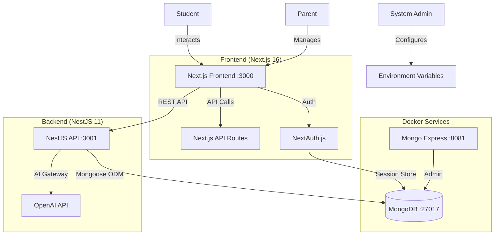

# Technical Architecture Document: VibeStudy Platform

## 1. System Overview
The VibeStudy platform is a modern educational application built with a decoupled architecture separating the frontend learning interface from the backend API services. The system uses a **microservices-inspired** architecture with a NestJS backend API and Next.js frontend.

### Key Technology Stack
*   **Frontend:** Next.js 16 (React 19 with App Router)
*   **Backend:** NestJS 11 (Node.js REST API)
*   **Database:** MongoDB 7 (via Docker Compose)
*   **Authentication:** NextAuth.js 4 (with MongoDB Adapter)
*   **UI Framework:** TailwindCSS 4, Lucide Icons
*   **Drag & Drop:** @dnd-kit (Kanban functionality)
*   **Game Engine:** Phaser 3 (Virtual lab simulations)
*   **AI Integration:** OpenAI Compatible API (GPT-4, Local LLMs)
*   **Container Runtime:** Docker & Docker Compose
*   **Validation:** Zod (Frontend & Backend)

## 2. Architecture Diagram


## 3. Service Architecture

### 3.1. Docker Compose Services
The development environment is managed via Docker Compose ([`compose.yaml`](../../compose.yaml)):

| Service | Image | Port | Purpose |
|---------|-------|------|---------|
| `mongodb` | `mongo:7` | 27017 | Primary database for all application data |
| `mongo-express` | `mongo-express:latest` | 8081 | Web-based MongoDB admin (dev only, profile: admin) |

### 3.2. Application Services

| Service | Port | Technology | Purpose |
|---------|------|------------|---------|
| Frontend | 3000 | Next.js 16 | User interface, SSR, Authentication |
| Backend | 3001 | NestJS 11 | REST API, Business Logic, AI Integration |

## 4. Data Layer

### 4.1. MongoDB Collections
*   **users**: User accounts and profiles (managed by NextAuth)
*   **sessions**: Active user sessions (NextAuth adapter)
*   **accounts**: OAuth provider accounts (NextAuth adapter)
*   **experiments**: Virtual lab experiment data and results
*   **quests**: Learning quests/tasks for Kanban board
*   **predictions**: Student prediction logs for AI analysis

### 4.2. Quest/Task Entity Schema
```typescript
interface Quest {
  _id: ObjectId;
  title: string;
  description: string;
  status: 'todo' | 'in-progress' | 'review' | 'done';
  assignedTo: ObjectId;
  priority: 'low' | 'medium' | 'high';
  dueDate?: Date;
  createdAt: Date;
  updatedAt: Date;
}
```

### 4.3. Experiment Entity Schema
```typescript
interface Experiment {
  _id: ObjectId;
  userId: ObjectId;
  experimentType: string;
  configuration: Record<string, any>;
  predictions: ExperimentPrediction[];
  results: ExperimentResult[];
  createdAt: Date;
  completedAt?: Date;
}
```

## 5. Frontend Implementation Details

### 5.1. Directory Structure
```
frontend/
├── app/                    # Next.js App Router
│   ├── layout.tsx         # Root layout with providers
│   ├── page.tsx           # Home page
│   ├── login/             # Authentication pages
│   ├── dashboard/         # Student dashboard
│   └── api/               # API routes (NextAuth)
├── components/
│   ├── dashboard/         # Kanban board components
│   │   ├── DashboardLayout.tsx
│   │   ├── KanbanBoard.tsx
│   │   ├── KanbanColumn.tsx
│   │   └── QuestCard.tsx
│   └── lab/               # Virtual lab components
├── lib/                   # Utility functions
└── middleware.ts          # Auth middleware
```

### 5.2. State Management
*   **Server State:** React Server Components, Next.js data fetching
*   **Client State:** React useState/useContext for UI state
*   **Authentication:** NextAuth.js session management
*   **Drag & Drop:** @dnd-kit for Kanban board interactions

## 6. Backend Implementation Details

### 6.1. Directory Structure
```
backend/
├── src/
│   ├── main.ts              # Application entry point
│   ├── app.module.ts        # Root module
│   ├── database/            # MongoDB connection module
│   │   └── database.module.ts
│   ├── experiments/         # Experiments feature module
│   │   ├── experiments.controller.ts
│   │   ├── experiments.service.ts
│   │   ├── experiments.module.ts
│   │   └── dto/
│   ├── quests/              # Quests feature module
│   │   ├── quests.controller.ts
│   │   ├── quests.service.ts
│   │   └── quests.module.ts
│   └── ai/                  # AI service integration
└── test/                    # E2E tests
```

### 6.2. API Endpoints

| Method | Endpoint | Description |
|--------|----------|-------------|
| GET | `/api/quests` | List all quests |
| POST | `/api/quests` | Create a new quest |
| PATCH | `/api/quests/:id` | Update quest status |
| DELETE | `/api/quests/:id` | Delete a quest |
| GET | `/api/experiments` | List experiments |
| POST | `/api/experiments` | Create experiment |
| POST | `/api/experiments/:id/predict` | Log prediction |

## 7. AI Content & Summary Pipeline

### 7.1. OpenAI Integration
The backend integrates with OpenAI-compatible APIs for:
*   **Learning Summaries:** Analyzing student progress and generating insights
*   **Content Generation:** Creating educational content from prompts
*   **Prediction Feedback:** Providing feedback on student predictions in virtual labs

### 7.2. Configuration
```env
# backend/.env
OPENAI_API_KEY=sk-your-key-here
# or for local LLMs:
# OPENAI_API_BASE=http://localhost:1234/v1
```

## 8. Development Environment Setup

### 8.1. Prerequisites
- Node.js 20+
- Docker & Docker Compose
- npm or yarn

### 8.2. Quick Start
```bash
# 1. Start database services
docker compose up -d

# 2. Start backend (in one terminal)
cd backend && npm install && npm run start:dev

# 3. Start frontend (in another terminal)
cd frontend && npm install && npm run dev
```

### 8.3. Environment Variables

**Backend ([`backend/.env`](../../backend/.env)):**
```env
MONGO_URI=mongodb://localhost:27017/vibestudy
PORT=3001
OPENAI_API_KEY=sk-your-key-here
```

**Frontend ([`frontend/.env`](../../frontend/.env)):**
```env
MONGO_URI=mongodb://localhost:27017/vibestudy
NEXTAUTH_SECRET=your-secret-here
NEXTAUTH_URL=http://localhost:3000
```

### 8.4. Admin Tools
To start with MongoDB admin interface:
```bash
docker compose --profile admin up -d
# Access at http://localhost:8081 (admin/admin123)
```

## 9. Deployment Architecture

### 9.1. Production Considerations
*   **Database:** Use MongoDB Atlas or self-hosted MongoDB with authentication
*   **Backend:** Deploy NestJS to containerized environment (Docker, Kubernetes)
*   **Frontend:** Deploy Next.js to Vercel or containerized environment
*   **Environment:** Use secrets management (Vault, AWS Secrets Manager)

### 9.2. CI/CD Pipeline
*   **Trigger:** Git commits to main/release branches
*   **Build:** Docker multi-stage builds for optimized images
*   **Test:** Run unit and E2E tests before deployment
*   **Deploy:** Rolling updates with health checks

## 10. Security & Privacy
*   **Authentication:** NextAuth.js with secure session cookies
*   **API Security:** JWT tokens for backend API authentication
*   **CORS:** Configured to allow only frontend origin
*   **Environment Variables:** Sensitive data stored as environment variables
*   **Database:** Connection strings never exposed to client
*   **No PII Exposure:** Student data encrypted and access-controlled
